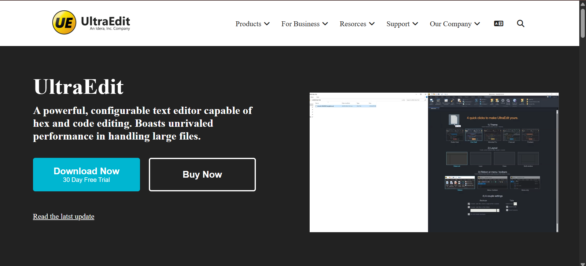

# 🖊️ Ultra Edit Clone

A lightweight clone or inspired version of the UltraEdit text editor interface, built using **HTML**, **CSS**.

---

## 🔗 Live Demo

[Try It Live](https://github.com/builtbyusman/UltraEdit-Clone)

---

## 📸 Screenshot

---

## ✨ Features

- Code editor-style interface
- Theme styling similar to UltraEdi

---

## 📁 Project Structure

ultra-edit/
│
├── index.html
├── style.css
├── script.js
├── screenshots/
│ └── images/
└── README.md

---

## 🧪 How to Use

1. Clone or download this repository.
2. Open `index.html` in your browser.
3. Start typing — just like a basic text/code editor.

---

## 🛠 Tech Stack

- HTML5
- CSS3
---

## 📄 License

This project is licensed under the [MIT License](LICENSE).

---

## 👨‍💻 Author

Created by **Muhammad Usman**  
📫 [Email](mailto:developerusman23@gmail.com)  
💼 [LinkedIn](https://www.linkedin.com/in/muhammad-usman-862693367/)
